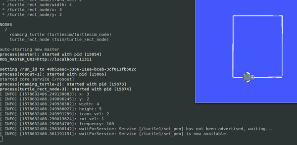
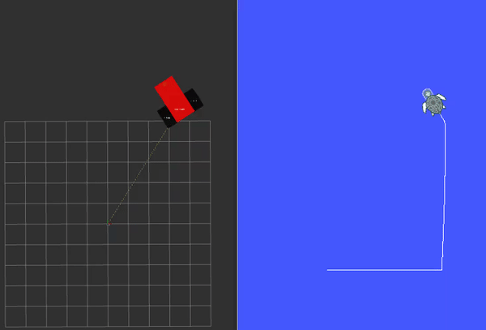

# ME495 Sensing, Navigation, and Machine Learning
# Package: tsim
Author: Maurice Rahme

## Package Summary

This package makes the turtle in turtlesim trace a rectangular trajectory while showing a plot of the absolute position error (x, y, theta) between the pure-feedforward and the actual turtle position as read from the `turtle1/pose` topic. It also has a service, `traj_reset`, which teleports the turtle back to its initial configuration whenever called.

A separate launchfile within this package makes the turtlesim trace a pentagon by default - although you may change the trajectory shape by updating `turtle_way.yaml` - and launches Rviz to make the `diff_drive` robot trace the same trajectory using an kinematic model. The `turtle_pent.launch` launchfile performs the turtlesim portion of this task.

Resultant Simulation for both launchfiles respectively:

## Launch Instructions
To launch the `turtle_rect` node without showing the position error plot, run: `roslaunch tsim trect.launch`.

To launch the `turtle_rect` node while showing the position error plot, run: `roslaunch tsim trect.launch plot_gui:=1`.

To launch the `turtle_way` node, which traces the pentagon by default with no position error plot, run: `roslaunch tsim turtle_pent.launch`.

To launch the `turtle_way` node while showing the position error plot, run: `roslaunch tsim turtle_pent.launch plot_gui:=1`.

To launch the Rviz tracing subset of the package without the position error plot, run: `roslaunch tsim turtle_odom.launch`.

To launch the Rviz tracing subset of the package while showing the position error plot, run: `roslaunch tsim turtle_odom.launch plot_gui:=1`.

## turtle_way_node.cpp
This node uses functionality from the `rigid2d` package, namely the `DiffDrive` and `Waypoints` classes, which model a differential drive robot and actuate the waypoint following sequence respectively. It uses open-loop Proportional control with the fordward-predicted differential drive model pose as an input to the control loop, to send appropriate Twist commands to the turtlesim. The `poseCallback (void)`, position callback function subscribes to `turtle1/pose` and uses this information to create the position error plot alongside the forward-predicted differential drive model pose. Note that the Twist sent to the turtlesim is divided by the loop rate before it is fed to the differential drive model for forward propagation.

## fake_diff_encoders_node.cpp (rigid2d package)
This node reads the Twist commanded to the turtle via the `cmd_vel` topic, divides it by the loop rate of the `turtle_way_node` node, and uses it to forward-propagate the differential drive model using `DiffDrive::feedforward()` to retrieve the resultant wheel angles from performing this twist. These are then published to the `/joint_states` topic, which Rviz reads to assign the wheel angles. 

## odometer_node.cpp (rigid2d package)
This node subscribes to `/joint_states` to get the wheel angle values from the joint state publisher, and uses these to forward-propagate the differential drive model using `DiffDrive::updateOdometry`, which also returns the resultant wheel velocities and internally updates the robot's pose. These wheel velocities are fed to `DiffDrive::wheelsToTwist()` to return the corresponding Twist of the robot. Finally, the pose and Twist retrieved from these operations are published as `tf2` frames to simulate the robot's motion in RViz.

## turtle_rect_node.cpp
This is the executable node, which initialises the node, creates a `Node Handle`, and includes the `TurtleRect` class to make the turtle in turtlesim trace a rectangular trajectory while showing a plot of the absolute position error (x, y, theta) by calling its public `control` method, making it loop indefinitely until it is interrupted.

## turtle_rect.cpp
This is the Class Constructor for `TurtleRect` containing the following methods:

* `traj_resetCallback (bool)`: callback for `traj_reset service`, which teleports turtle back to initial config.
* `poseCallback (void)`: callback for `turtle1/pose` subscriber, which records the turtle's pose for use elsewhere.
* `move (void)`: helper function which publishes `Twist` messages to `turtle1/cmd_vel` to actuate the turtle.
* `predict(void)`: helper function which forward propagates the open-loop model and publishes `PoseError` to `pose_error`.
* `control(void)`: main class method. Houses state machine and calls helper function to perform trajectory and plot.

## turtle_rect.h
Header file for the `TurtleRect` class.

## trect.launch
Calls the `roaming_turtle` node from `turtlesim`, as well as the `turtle_rect_node` node from this package, and gives the user an option to show the error plot using the `plot_gui` argument, which defaults to `False`.

## turtle_rect.yaml
Contains the parameters for executing the rectangular trajectory.

* `x (int)`: x coordinate for lower left corner of rectangle.
* `y (int)`: y coordinate for lower left corner of rectangle.
* `width (int)`: width of rectangle.
* `height (int)`: height of rectangle.
* `trans_vel (int)`: translational velocity of robot.
* `rot_vel (int)`: rotational velocity of robot.
* `frequency (int)`: frequency of control loop.
* `threshold (float)`: specifies when the target pose has been reached.

## Resultant Plot for turtle_rect_node

Note that the plot increases in drift over time as the forward propagated controls would result in several superimposed but slanted rectangular trajectories (as you saw from Josh ealier today) were it not for the feedback control implemented here to stop and start the linear and angular velocity commands. The error plot hence descibres the difference between pure feedforward control and the implementation done here. Calling the `traj_reset` service resets this error to zero temporarily, before re-commencing the trajectory and ensuing in drift as seen below.

## Resultant Plot for turtle_way_node

